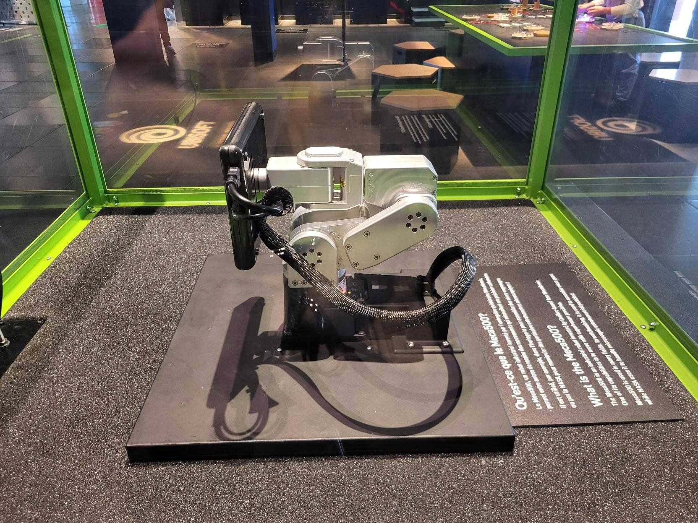

# Robot qui danse 
Le centre des sciences de Montréal présente *Danse, robot, danse!*, qui est un robot qui s'anime selon les blocs qui lui sont placés, créer par **Ubisoft**. J'ai visité le centre des sciences le 5 avril 2024. C'est une exposition qui est permanente, le dispositif sera mis en exposition jusqu'à que celui-ci ne marche plus.

## Description de l'oeuvre
*Danse, robot, danse!* est un robot qui danse dépendant les blocs qu'on lui place. Chaque bloc est un mouvement différent ou une expression différente. En plaçant les blocs dans un certain ordre, permet au robot de recréer ses mouvements et/ou expression dans le même ordre. Pendant qu'il danse, il y a une petite musique qui sonne à partir du petit haut-parleur qui est dans la table.

## Type d'installation
C'est une installation interactive parce qu'elle permet aux visiteurs d'interagir avec le robot en lui proposant de placer des blocs pour que le robot puisse commencer à danser.
## Mise en espace
Le robot se trouve dedans une vitrine et sur une table. Devant la vitrine, il y a des blocs, des trous pour placer les blocs, un bouton jaune et un petit haut-parleur incruster dans la table. Dedans la vitrine, on peut observer une petite caméra. Le champ de vision de la caméra est vers les trous où on peut placer les blocs.
## Composantes et techniques
Les composantes du dispositif sont le robot MECA500, la caméra, le montage sonore (la musique), les blocs qui indiquent au robot ses mouvements et les différents câbles nécessaires à son fonctionnement.
## Éléments nécessaires à la mise en exposition
- Table
- Vitrine
- Bouton
##  Expérience vécue
Le visiteur choisit les mouvements ou expressions qu'il veut que le robot reproduise en choisissant les bons blocs. Il place les blocs dans un certain ordre et, quand il a fini, il appuie sur le bouton pour que le robot puisse commencer. Le robot va commencer à suivre le patron qu'il lui a été assigné avec une musique de fond. Quand le robot finit de danser, le visiteur peut changer l'ordre des blocs ou changer de blocs et appuie encore sur le bouton pour que le robot recommence.
## Mon opinion
### Ce qui m'a plu
J'ai apprécié que chaque bloc ait une image qui représente l'action que le robot ferait, ça aide aux enfants à comprendre chaque bloc fait quoi. J'ai trouvé que c'était une installation très simple mais très intéressante pour les enfants.
###  Aspect que je ne souhaiterais pas retenir pour mes propres créations ou que je ferais autrement
Ce que je ferais autrement serait que soit je rajouterais un autre haut-parleur ou augmenter le volume de la musique. Il y a beaucoup d'enfants sur place et c'est naturel qu'ils fassent beaucoup de bruit et, à cause, de cela c'était difficile d'écouter la musique. C'est plus amusant, pour les enfants, voir le robot danser avec la musique. Aussi, je rajouterais peut-être le fait qu'il y ait différentes musiques jouables et que ça soit contrôlable par les blocs, de la même façon que les mouvements.
