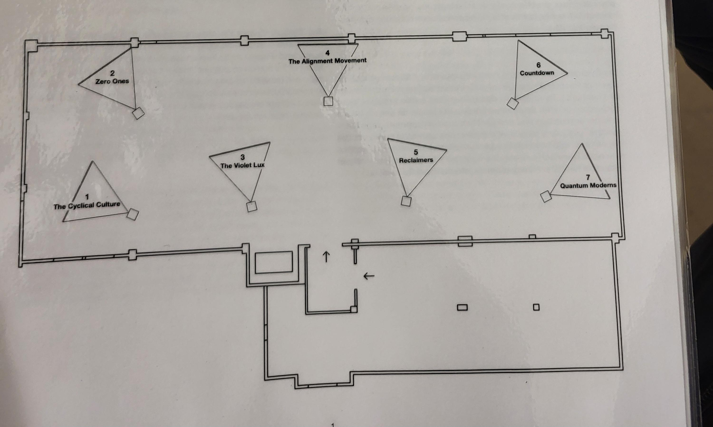

# Phase shifting index
Hors les murs présente l'oeuvre Phase Shifting Index réaliser en 2020 par l'artiste Jeremy Shawn. J'ai visité l'exposition le 2 février 2024 à La Fonderie Darling. L'exposition est situe temporairement à La Fonderie Darling jusqu'à que les rénovations du MAC (Le Musée d’art contemporain) finissent, mais c'est une exposition qui devrait être permanente et d'intérieur.

## Description de l'oeuvre
Combinant vidéo, son et lumière, l'installation *Phase Shifting Index* [Index d'états de transition] (2020) est une rêverie postdocumentaire d'une remarquable ambition. Sur septs grands écrans défilent des images représentant sept groupes distincts de personnes ou de <<sous-cultures>> effectuant diverses danses, ainsi que des thérapies et des exercices basés sur le mouvement. Ces images, qui semblent tirées de films documentaires datant des années 1960 aux années 1990, sont présentées dans leurs formats du XXe siècle, allant du 16 mm VHS et au Hi-8. Cependant, elles ont été imaginées comme appartenant au futur, dans anticipation narrative des évolutions sociales à venir.

Plusieurs participant sont interviewés, mais il est difficile de comprendre leurs propos sans lire les sous-titres pour avoir une idée de leur quête de transdence et de leur désir de communauté. Parallèlement, une voix hors champ, d'une tonalité ethnographique, jette un regard rétrospectif, depuis un futur qui les dépasse, sur l'émergence de ces groupes énigmatiques qui étaient capables de modifier physiquement leur réalité grâce au mouvement et à la croyance.

Cette installation immersive nous plonge littéralement dans un tourbillon de mouvements frénétiques et d'états mentaux altérés, brouillant notre perception du temps et de l'espace, de l'imagination et de la réalité. Les écrans tissent une narration intrigante qui se déploie habilement et inexorablement pour aboutir à une synchronisation <<trans-temporelle>> stroboscopique, où tous les sujtes se rejoignent dans une catharsis collective. Pendant un moment, nous expérimentons l'unité et le ravissement, alors que Shawn renverse la confiance que nous avons en l'autorité conférée aux stratégies documentaires - ou, plûtot, met en lumière notre méfiance envers ces stratégies.
Source: Le cartel de l'exposition 

Le cartel de l'exposition
## Type d'installation
L'oeuvre est une installation immersive qui permet au public de plonger dans les différentes vidéos qui se présenter.

## Mise en espace
L'oeuvre se trouve dans un espace large, qui a la forme d'un rectangle. Les écrans, utilisés pour afficher les vidéos qui former l'oeuvre, étaient accroché au toit. Les 7 écrans placé en 2 rangée, 4 écrans dans la rangée de devant et 3 écrans de la rangée de derrière. Tout les écrans étaient inliner dans un certain angle pour que le public puisse se concentrer dans 1 vidéo à la fois. La salle était assez spacieuse pour que le public puisse se déplacer dans la pièce. La pièce était plongée dans le noir la seule lumière provener des projecteurs. Il y a des bancs placés devant les écrans pour que le publics puissent s'asseoir.

Croquis de la salle d'exposition fait par le musée 

Salle d'exposition

## Composantes et techniques
La composante qui devrait voyager serait les écrans où seront afficher les vidéos et l'artiste doit envoyer les montages vidéos et les conceptions sonores qu'il a composer. Il devra également envoyer les effets visuels, par exemple les effets de couleurs, qu'il a fait pour l'oeuvre.

## Éléments nécessaires à la mise en exposition
- Bancs
- Projecteurs
- Haut-Parleur
- Câble ( pour accrocher les haut-parleurs, les écrans et les projecteurs au toît)
- Bancs

##  Expérience vécue
Le visiteur peut se promener dans la salle pour observer les différentes vidéos, mais il a l'option de s'asseoir pour être capable de se concentrer et s'immerger dans une des 7 vidéos présenter. Pendant un certain temps, les vidéos joue en boucle pour que le visiteur puisse observer toutes ou la majorité des vidéos et qu'il comprenne que toutes les personnes dans les vidéos sont reliés d'une certaine manière. Après un certain temps, les vidéos arrête de jouer en boucle et toute les écrans se rejoignent. Des effets visuels immerse le visiteur.

## Mon opinion
### Ce qui m'a plu

###  Aspect que je ne souhaiterais pas retenir pour mes propres créations ou que je ferais autrement
