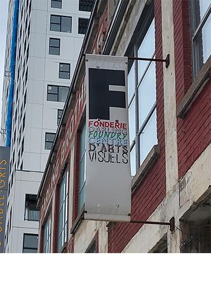

# Phase shifting index
Hors les murs présente l'oeuvre Phase Shifting Index réaliser en 2020 par l'artiste Jeremy Shawn. J'ai visité l'exposition le 2 février 2024 à La Fonderie Darling. L'exposition est situe temporairement à La Fonderie Darling jusqu'à que les rénovations du MAC (Le Musée d’art contemporain) finissent, mais c'est une exposition qui devrait être permanente et d'intérieur.

## Description de l'oeuvre

## Type d'installation
L'oeuvre est une exposition immersif qui permet au public de plonger dans les différentes vidéos qui se présenter.

## Mise en espace
L'oeuvre se trouve dans un espace large, qui a la forme d'un rectangle. Les écrans, utilisés pour afficher les vidéos qui former l'oeuvre, étaient accroché au toit. Les 7 écrans placé en 2 rangée, 4 écrans dans la rangée de devant et 3 écrans de la rangée de derrière. Tout les écrans étaient inliner dans un certain angle pour que le public puisse se concentrer dans 1 vidéo à la fois. La salle était assez spacieuse pour que le public puisse se déplacer dans la pièce. La pièce était plongée dans le noir la seule lumière provener des projecteurs.

## Composantes et techniques

## Éléments nécessaires à la mise en exposition

##  Expérience vécue

## Mon opinion
### Ce qui m'a plu

###  Aspect que je ne souhaiterais pas retenir pour mes propres créations ou que je ferais autrement
