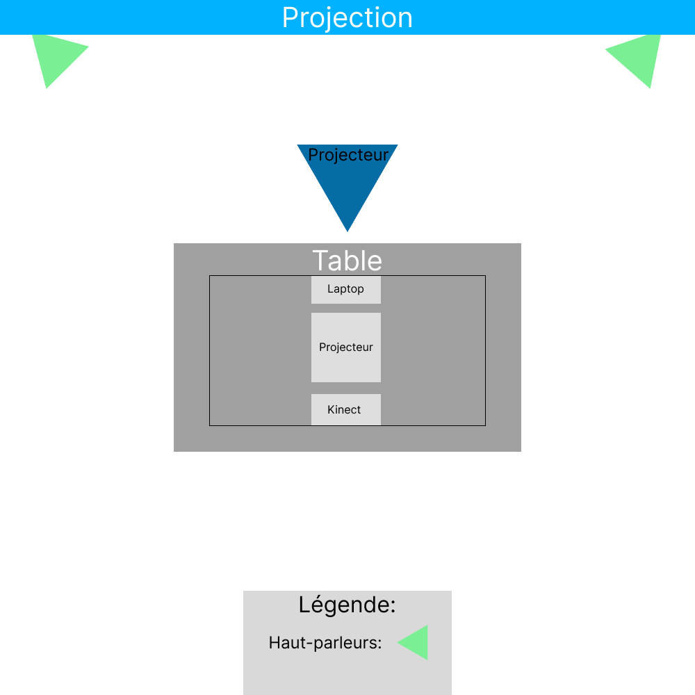

 # Sommaire des projects

## Rhizomatique
Les créateurs du projet *Rhizomatique* sont  Jolyanne Desjardins, Maïka Désy, Laurie Houde, et Felix Testa Radovanovic.Le mot "Crescentia" veut dire croissance en *latin*.Le lien avec le thème *Crescentia* est que, dans l'exposition Rhizomatique, le public voyage dans le passé d'une autre personne, donc elle observe la croissance que sa soit psychologique ou physique de l'autre personne.

#### Voici le schéma de l'installation prévue:

Source:<https://tim-montmorency.com/2024/projets/Rhizomatique/docs/web/preproduction.html#Sch%C3%A9mas-ou-plans-techniques>
## Effet-Papillon
Les créateurs du project *Effet-Papillon* sont Raphaël Dumont, Alexis Bolduc, William Morel, Alexia (Ryan) Papanikolaou, Viktor Zhuravlev et Jasmine Lapierre. Le lien avec le thème Crescentia est que le public observe tout ce qui provoque la croissance de l'arbre et ce qui se passe dans son environnement.

#### Voici le schéma de l'installation prévue:

Source:<https://tim-montmorency.com/2024/projets/Effet-Papillon/docs/web/preproduction.html#Sch%C3%A9mas-ou-plans-techniques>
## Kigo
Les créateurs du project *Kigo* sont Érick Ouellette, William Rathier Mailly, Gabriel Clerval, Nicolas St-Martin et Antoine Dion.Durant le jeu, plus que tu obtient de point et que tu évite les obstacles, plus la difficulté augmente. Ceci pourrait deémontrer une croissance dans la difficulté du jeu pour mettre au défi le joueur, c'est ce qui relie *Kigo* avec *Crescentia*.

#### Voici le schéma de l'installation prévue:

Source:<https://tim-montmorency.com/2024/projets/Kigo/docs/web/preproduction.html>
## Canevas-Cosmique
Les créateurs du projet *Canevas-Cosmique* sont Jacob Alarie-Brousseau, Étienne Charron, Jérémy Cholette, Quoc Huy Do et Mikaël Tourangeau.*Canevas-cosmique* est un jeu qui simule le système solaire et qui permet de créer plusieurs et différents phénomènes en plaçant les statues qui simule les planettes. Le lien avec *Crescentia* est que dans le jeu tu est en contrôle de la croissance des planétes et du système solaire. 
.
#### Voici le schéma de l'installation prévue:

Source:<https://tim-montmorency.com/2024/projets/Canevas-Cosmique/docs/web/preproduction.html#Sch%C3%A9mas-ou-plans-techniques>

## 3 cours du programme incontournables 
Je pense que le cours d'interactivité ludique, de réalité mixte et d'objets interactifs sont indispensable pour avoir les compétences nécessaires pour créer ce type d'installation.[..]

## Technique ou composante technologique utilisé dans un des projects
J'ai remarquer que quelques projects utilisé la kinect. Je ne connaissait pas cette composante, mais après quelques recherches j'ai pu comprendre son utilité. La kinect est une caméra qui permet le contrôle d'une interface sans l'utilisation d'un mannette. On peut interagir avec la kinect par une commande vocal ou par la reconnaisance de mouvement ou d'image.
## Préférence des projects
Mon projet préféré est *Sonalux* parce que c'est le project le plus immersif à mon avis. Les autres oeuvres étaient intéressantes mais *Sonalux* étaient celui qui a attiré le plus mon attention, le deuxième serait *Rhizomatique*. Je pense que cette oeuvre et celui qui arrive à avoir une plus grande connection avec le visiteur et permet au visiteur de s'explorer.

