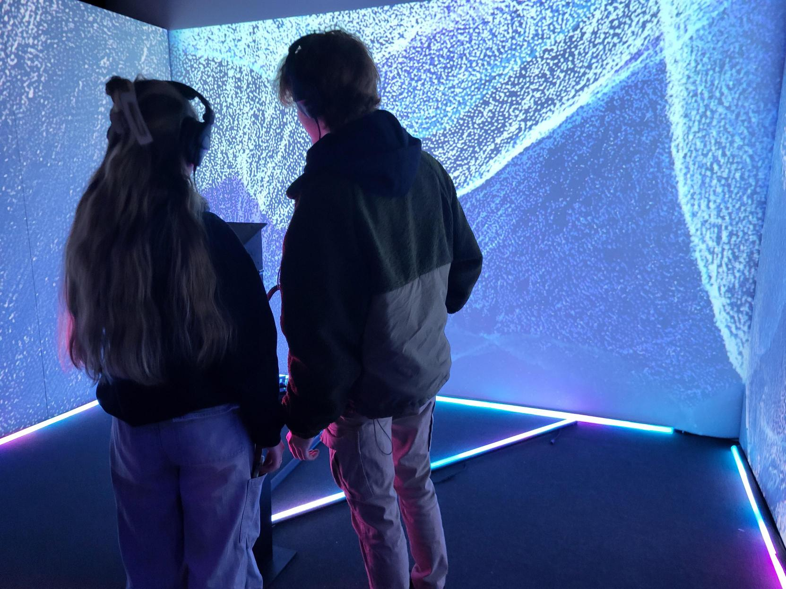
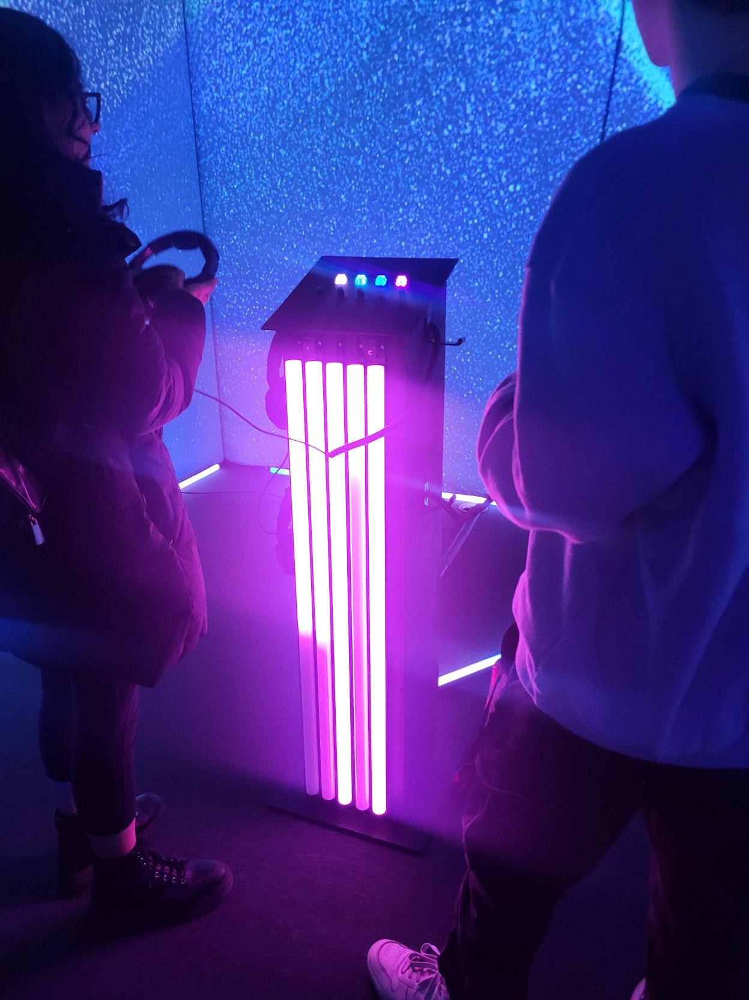
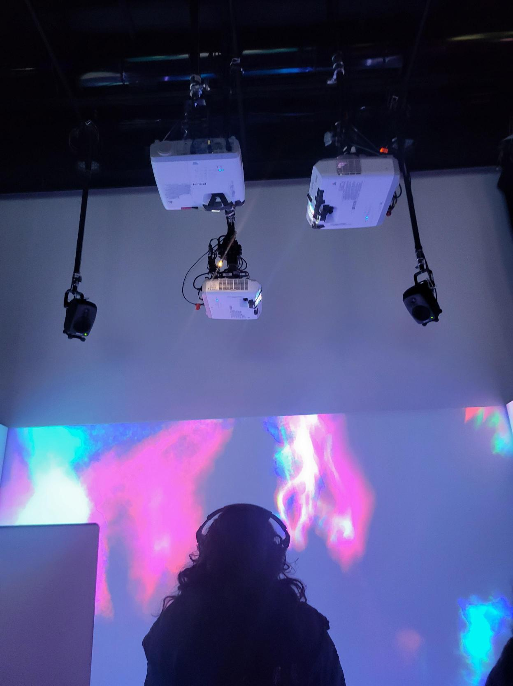

# Sonalux
Crescentia a présenté l'œuvre *Sonalux* réaliser en 2024 par Antoine Haddad, Camélie Laprise, Ghita Alaoui, Vincent Desjardins. Crescentia est l'exposition finale des étudiants en techniques d'intégration multimédia du Collège Montmorency. Sonalux est une exposition temporaire et non-permanente parce qu'elle a été ouverte au public pendant 1 semaine seulement, du 18 au 22 mars 2024. J'ai visité l'exposition le 20 février, lorsque les expositions étaient en production, et le 12 mars, lorsque les expositions étaient finalisées. 
## Description de l'oeuvre
> <<Sonalux est une expérience qui se distingue par son environnement visuel et sonore évolutif contrôlé par les gestes posés par les interacteurs les amenant vers un tout nouvel univers qui leur est propre. Le public est appelé à découvrir les particularités de l'expérience en explorant les diverses composantes de la boîte ainsi que ses différentes scènes visuelles.>>

Source:(https://tim-montmorency.com/2024/projets/Sonalux/docs/web/preproduction.html#Synopsis)Préproduction de l'équipe de Sonalux

## Type d'installation
L'œuvre est une installation immersive et interactive, parce qu'elle permet au visiteur de plonger dans le paysage visuel et sonore et elle lui permet de créer son monde immersif en jouant avec les sons et avec le visuel.
## Mise en espace
  <<L'expérience se déroule entre 3 murs blancs, dont deux qui sont mobiles. Dans les herses, il y a deux hauts-parleurs ainsi que 3 projecteurs accrochés afin de projeter les sons génératifs et trois projections visuelles génératives. Au centre de l'installation se trouve un podium qui sert à contrôler les différents paysages sonores et visuels de l'expérience. Pour ce faire, l'interacteur va utiliser les composantes M5Stack placées au dessus du podium, c'est-à-dire les Angle Unit et les Key Unit. Le podium est décoré de tubes DEL sur le devant qui sont synchronisés avec l'expérience tel que ceux qui sont disposés au sol.>>

Source: https://tim-montmorency.com/2024/projets/Sonalux/docs/web/preproduction.html (préproduction de l'équipe de production de Sonalux)

## Composantes et techniques
- Fils XLR 3 conducteurs de 15' (M->F)
- Interface audio USB disposant 8 sorties et au moins 1 entrée
- Carte de son
- Fils cat6a de 15"
- Switch POE 5 ports
- M5Stack
- Atom Lite
- Atom POE
- Angle Unit
- Key Unit
- ToF Unit
- PBHub
- GroveHub
- PaHub

  

## Éléments nécessaires à la mise en exposition
- Projecteurs
- Tubes DEL
- Hauts-parleurs
- casque d'écouteurs
- Spotlight
- Podium
- Mur mobiles
- Extensions pour les câbles
- Ordinateur portable
- Câbles pour haut-parleurs
- Crochets ( pour accrocher les projecteurs, hauts-parleurs et spotlight au pont qui est au plafond)

  

##  Expérience vécue
Le visiteur se place devant le podium et commence à jouer avec les key unit et les tof unit. Il peut porter le casque d'écouteur pour écouter mieux la composition sonore, mais ce n'est pas obligatoire puisqu'il y a des hauts-parleurs. En jouant des key units, il rajoute ou enlève des sons et, en jouant avec les tof units, il joue avec le visuelle. Quand le visiteur joue avec les key units et tof units, les tubes de lumière sur le podium change dépendamment ce que le visiteur change.

## Mon opinion
### Ce qui m'a plu
J'ai adoré le fait qu'on puisse contrôler la composition sonore et le visuelle avec les key units et tof units. Il y avait 4 key unit et 5 tof unit. Les keys contrôler les sons et les tof contrôler le visuel. Ça permet au visiteur de créer son propre monde immersif et d'expérimenter avec toutes les touches. J'ai aimé que cette œuvre soit immersive et interactive.

###  Aspect que je ne souhaiterais pas retenir pour mes propres créations ou que je ferais autrement
 Je voudrais rajouter que les murs soient tactiles, donc quand le visiteur passe sa main sur le mur, les lignes bouge selon le mouvement de la main. Ça permettrait au visiteur de se déplacer et pouvoir avoir un contact avec le monde immersif qu'il a lui-même créer.
