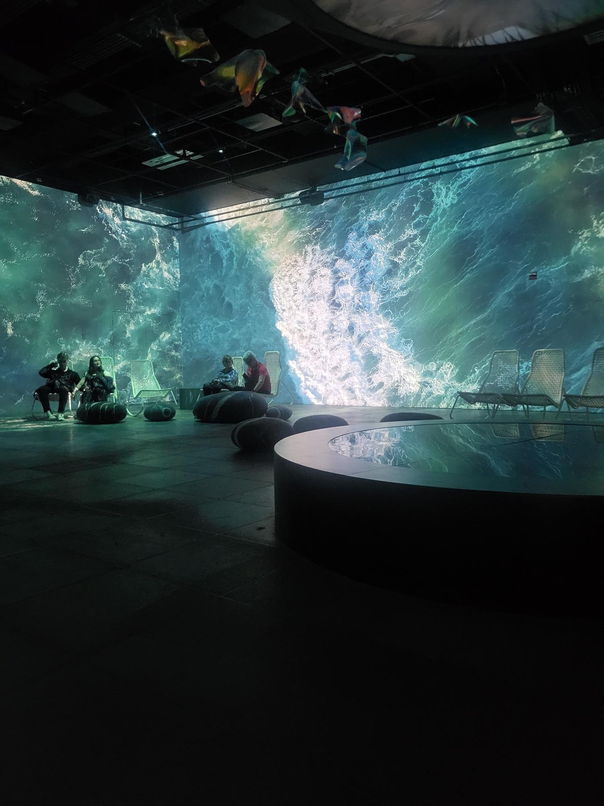

# Nature Vive
OASIS immersion présente l'œuvre *Nature Vive* réaliser en 2022 en collaboration avec l'équipe de **National Geographic**. L'OASIS immersion est un musée qui met en scène des arts immersifs et présente des sujets d'actualité. J'ai visité *Nature Vive* le 5 mars 2024. C'est une exposition temporaire et non-permanente qui se trouve au Palais de congrès et qui sera ouvert jusqu'au 31 mai 2024.

## Description de l'oeuvre
> <<Dans le premier tableau de l'exposition, grâce aux images saisissantes de National Geographio, nous vous invitons à renouer avec la nature. Vous serez immergés dans sa splendeur, sa grandeur et sa richesse en diversité.Cette oeuvre fait également écho à l'immense capacité de régénération des écosystèmes lorsqu'ils sont préservés. C'est une célébration de la force tranquille qui réside dans l'ensemble des espèces et des microorganismes-bref' dans l'ensemble du monde vivant.>>
 
 Source: Cartel de *Un monde en régération* présenter avant l'oeuvre

> <<Dans ce deuxième tableau, l'art numérique et la science se rencontrent pour illustrer un principe fondamental: l'interdépendance des espèces. Ici, grâce à des techniques sophistiquées d'art numérique génératif, nous explorons comment chaque élément de la nature, de la plus petite cellule organique aux vastes réseaux de racines, est connecté dans une danse complexe et vitale.>>
 
 Source: Cartel de *Nous sommes interconnectés* présenter avant l'oeuvre

> <<Le dernier tableau  de l'exposition Nature Vive est une mosaïque vivante de la résilience de la nature et de l'ingéniosité humaine. L'oeuvre immersive illustre comment des efforts conjugués peuvent transformer notre relation avec la Terre et renverser des cycles destructeurs.>>
  
  Source: Cartel de *Élevons-nous face aux défis* présenter avant l'oeuvre

## Type d'installation
*Nature Vive* est une installation immersive permet aux visiteurs d'explorer la nature dans toute sa splendeur.

## Mise en espace
L'œuvre se dispose en 3 galeries. La première galerie se dispose de plusieurs fauteuils et de chaises berçante pour que les personnes puissent s'asseoir. Il y avait aussi au centre de la salle, un grand meuble rond et un miroir entouré de papillon holographique qui était accroché au pont qui est accroché au plafond. Dans la deuxième galerie, il y avait des petits bancs ronds dispersé dans toute la salle et un grand banc long en forme de "s" se trouver au milieu de la salle. Il y avait quelques structures illuminées en forme de cristaux faits de toile collée au banc et quelques miroirs circulaire accroché au pont du plafond au centre de la salle. Dans la troisième galerie, il y avait quelques bancs autour de la salle avec un grand banc au centre en forme de cercle. Dans toutes les salles, il y avait des projecteurs et des hauts-parleurs.

## Composantes et techniques
Les composantes seraient les montages vidéos et montages sonores de chaque galerie. 

## Éléments nécessaires à la mise en exposition
- Bancs
- Projecteurs
- Hauts-parleurs
- Grand mirroir
- Structure illuminé ( de la deuxième galerie)
- Papillon faite de plastique holographique ( de la première galerie )

##  Expérience vécue
Le visiteur rentre dans la première galerie est s'assoit sur une chaise ou sur un fauteuil. L'œuvre se passe sur les 4 écrans qui entourent le visiteur et la vidéo joue en boucle. Quand le visiteur finit de voir la vidéo, il peut passer dans la deuxième galerie. Dans celle-ci, il y a encore des bancs, mais le visiteur peut se déplacer tout autour de la salle. Il y a une projection au sol et il y a des structures en forme de cristaux autour de la salle. La vidéo joue sur les 4 murs en boucle et le visiteur peut changer de galerie quand il a fini d'écouter la vidéo. Dans la dernière galerie, il y a encore des bancs, mais les artistes avaient pour but que le visiteur se déplace dans toute la salle (cette salle est plus grande que les autres.), donc, quand on se déplace, on voit une petite lumière au sol qui nous suit. La vidéo joue en boucle sur les 4 murs, mais des différentes informations sont afficher sur les murs.

## Mon opinion
### Ce qui m'a plu
J'ai beaucoup apprécié mon expérience de Nature Vive. L'œuvre accomplie son but d'immersion, les chambres sont plongée dans la noirceur. La seule lumière provient des écrans et les hauts-parleurs étaient placés tout autour de la salle et il y avait une résonnance. De plus, dans les 2 dernières galeries, il y avait une projection au sol. Dans la dernière galerie, la projection au sol suivait nos pas. Je sentais que je fessais parti de l'œuvre. Pour mes futures créations, j'aimerais retenir l'ambiance de l'œuvre, donc les lumières, la sonorisation et la résonnance, parce qu'elle permet plus facilement au visiteur le sentiment d'immersion. Aussi, le fait que chaque galerie ait son propre sujet, mais qu'ils soient un lien en commun et l'ordre dont les galeries sont disposées. J'avais l'impression que la première galerie était comme une introduction, la deuxième était le développement et le dernier était la conclusion.

###  Aspect que je ne souhaiterais pas retenir pour mes propres créations ou que je ferais autrement
Ce que je changerais serait les bancs, c'est un petit détail, mais que je trouve assez pertinent pour les visiteurs. Dans la première salle, ils étaient très confortables ce qui facilitait l'immersion, mais, dans les 2 autres, c'étaient des bancs en plastiques (les grands) ou des petit bancs de tissu sans dorsale. Je comprends que le but de ses salles est de se déplacer, un peu moins pour la deuxième, mais puisque c'est une œuvre pour tous les âges, je trouve que ça serait préférable des bancs plus confortables. Je trouverais sa pertinent pour l'immersion et pour les visiteurs.
